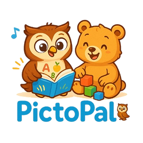

<p align="center">
  
</p>

# PictoPal

**PictoPal** is a fun and interactive Flutter app designed to help children under 5 learn new vocabulary through engaging visuals and playful activities.

[](https://github.com/Modaminstitute/pictopal-alpha)

---

## Features

- Colorful, kid-friendly UI
- Interactive vocabulary learning
- Custom illustrations and icons
- Cross-platform: Android, iOS, Web

## Getting Started

To run this project locally:

1. **Clone the repository:**

   ```sh
   git clone https://github.com/Modaminstitute/pictopal-alpha.git
   cd pictopal-alpha
   ```

2. **Install dependencies:**

   ```sh
   flutter pub get
   ```

3. **Run the app:**
   ```sh
   flutter run
   ```
## Resources

- [Flutter Documentation](https://docs.flutter.dev/)
- [Write your first Flutter app](https://docs.flutter.dev/get-started/codelab)
- [Flutter Cookbook](https://docs.flutter.dev/cookbook)
